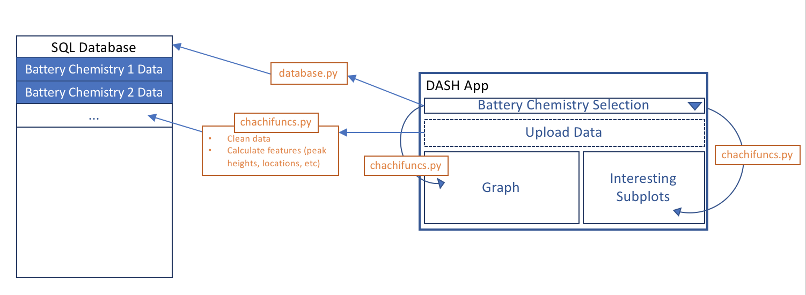

# Charged Chinchillas (ChaChies)  * 
## Package for Battery Cycling Data Visualization and Analysis
This package can be used to quantitatively analyze raw cycling data as differential capacity plots. Differential capacity plots (dQ/dV) can be very powerful for uncovering battery performance characteristics, as the peaks that appear in these plots correspond to the various electrochemical events. However, because of the large amount of data gathered many researchers report subsets of cycles and qualitative conclusions. This package hopes to quantify this type of analysis by cleaning battery cycling datasets and obtaining peak locations, widths, amplitudes, and other descriptors for every cycle. To this end, this tool develops individualized models for each charge and discharge cycle in the data set, comprised of a gaussian baseline and pseudo-voigt distributions at each peak location. 

Additionally, there is a DASH based visualization app that can be used as the user interface. Users can upload raw cycling data, either collected via a MACCOR or an Arbin cycler. The app will then process the data and add a few files to the database: the raw data, the cleaned data, and the peak descriptors for every cycle. The app also allows users to scroll through cycles and better understand the differential capacity curves. Additionally, there is a section to evaluate the fit of the gaussian baseline, and tailor the peak finding process. The user can also download the peak descriptors using the "Download CSV" file button in the app. 

Additionally, some machine learning was done to classify between two different cathode chemistries, LiCoO2 and LiFePO4. Data sets for these chemistries were obtained from the CALCE website(https://web.calce.umd.edu/batteries/data.htm). Once this data was cleaned and labelled, a 20-80 test-train split was done and a support vector classifier was utilized, with a final test set accuracy of 77%. 

### How to Install 
```
pip install chachies  
```
### Software Dependencies 
- Python3 
- For python packages see requirements.txt

## Organization of the project
```
app/
    data/
    README.md
    app.py 
chachies/ 
    data/
    tests/
        data/
        README.md
        __init___.py
        test_chachifuncs.py
        test_descriptors.py
    __init__.py
    chachies.py 
    chachifuncs.py
    descriptors.py 
    svc_model.sav
docs/ 
    design/
    ppt/
    README.md
examples/
    Images/ 
    README.md
LICENSE
README.md
requirements.txt
setup.py
```

## Preview of app 


For more see ```app/```

## Data Visualization 
Make sure to install the following dash libraries
```
pip install dash==0.21.0  # The core dash backend
pip install dash-renderer==0.11.3  # The dash front-end
pip install dash-html-components==0.9.0  # HTML components
pip install dash-core-components==0.18.1  # Supercharged components
pip install plotly --upgrade  # Latest Plotly graphing library
```

To run the app run the following in terminal:
```
python app.py
```
Which should return
```
 * Running on http://someurl/ (Press CTRL+C to quit)
```
Type that URL in browser to launch


*Images taken from Google Images at https://www.redbubble.com/people/ilovepaws/works/28793999-funny-dabbing-chinchilla and http://weclipart.com/cartoon+battery+clipart/d/1708675 

## Graphical Overview

