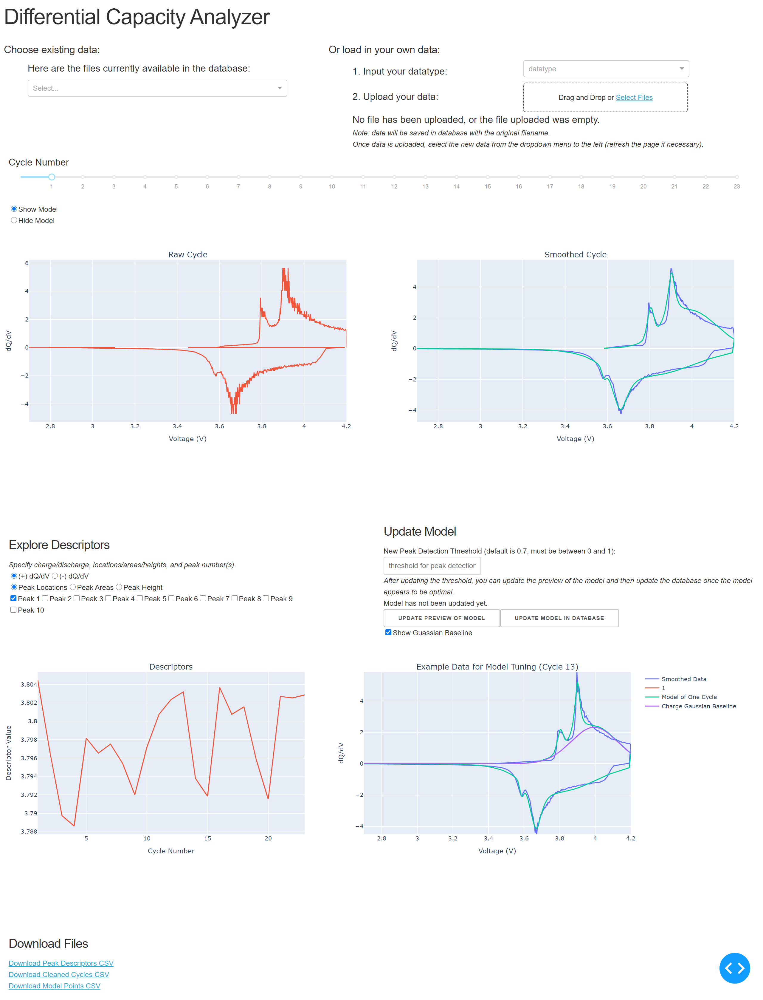
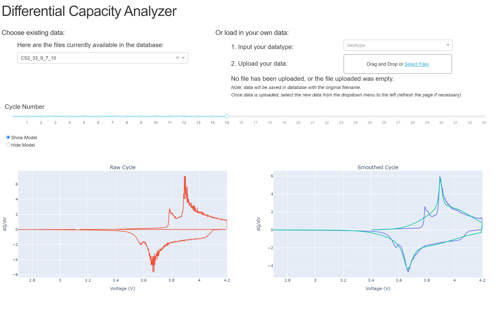
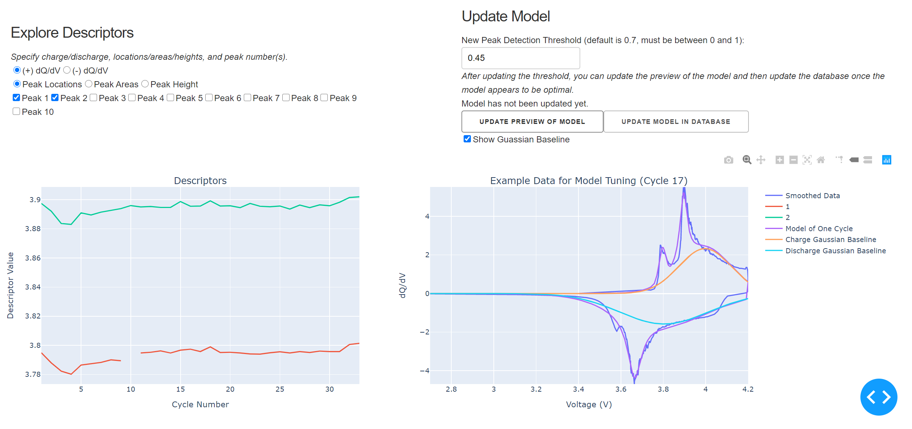

# DiffCapAnalyzer [](https://travis-ci.com/nicolet5/DiffCapAnalyzer) 
## Package for Battery Cycling Data Visualization and Analysis
This package is intended to quantitatively analyze raw cycling data by identifying and parameterizing peaks found in the differential capacity plots. Differential capacity plots (dQ/dV) can be very powerful for uncovering battery performance characteristics, as the peaks that appear in these plots correspond to the various electrochemical events. However, because of the large amount of data gathered during cycing experiments, many researchers report subsets of cycles and purely qualitative conclusions. This package adds the ability to quantify this type of analysis by cleaning battery cycling datasets and obtaining peak locations, widths, amplitudes, and other descriptors for every charge/discharge cycle in the data. To this end, this tool develops individualized fitted models for each charge and discharge cycle in the data set, comprised of a gaussian baseline and pseudo-voigt distributions at each peak location. 

Additionally, there is a DASH based visualization app that can be used as the user interface. Users can upload raw cycling data, either collected via a MACCOR or an Arbin cycler. The app will then process the data and add a few files to the database: the raw data, the cleaned data, and the peak descriptors for every cycle. The app also allows users to scroll through cycles and better understand the differential capacity curves. Additionally, there is a section to evaluate the fit of the gaussian baseline, and tailor the peak finding process. The user can also download the peak descriptors using the "Download CSV" file button in the app. 

Additionally, some machine learning was done to classify between two different cathode chemistries, LiCoO2 and LiFePO4. Data sets for these chemistries were obtained from the CALCE website(https://web.calce.umd.edu/batteries/data.htm). Once this data was cleaned and labelled, a 20-80 test-train split was done and a support vector classifier was utilized, with a final test set accuracy of 77%. 

### Software Dependencies 
- Python3 
- For python packages see requirements.txt

### How to Install
To run the app and fully utilize DiffCapAnalyzer and the corresponding examples, simply clone this repo and from the root directory run: 
```
pip install -Ur requirements.txt
```
This will install all packages necessary for DiffCapAnalyzer. 

To use the DiffCapAnalyzer functions without the app, you can pip install instead of cloning the entire repo: 
```
pip install diffcapanalyzer 
```
This will install the DiffCapAnalyzer modules for use in the example notebooks, or for using the package outside of the Dash app. For example usage of the functions outside of the Dash app, see `examples/ProcessData_PlotDescriptors_Examples.ipynb`, which serves as a guide for processing one file and plotting the results through a jupyter notebook instead of the Dash App. Additionally, `exmaples/Detailed_Steps_Example.ipynb` provides additional insight into data cleaning, peak finding, and model fitting. 


## Dash App Tutorial
After cloning this repo annd installing the requirements, the Dash app can be used to interact with the underlying DiffCapAnalyer functions to process cycling data and visualize results. To start the app run the following command in terminal from the root directory:
```
python app.py
```
Which should return
```
 * Running on http://someurl/
```
Type or copy that URL in browser to launch the app locally. From the browser you should be able to see something like this: 



The app initially loads with example data, as shown in the above image. You can explore that example data or you can upload new data. Example data sets to explore are found in this repo under `data/ARBIN/` and under `data/MACCOR/`. The Arbin data is obtained from the CALCE website (https://web.calce.umd.edu/batteries/data.htm), and are good examples of real dQ/dV data. The data under `MACCOR/` is a fabricated example, mainly meant to document the format of `MACCOR` data expected. Using one of the `ARBIN` data files, we can upload one by choosing the `ARBIN` option from the dropdown, and selecting our file for upload. Once the file is uploaded, the data is cleaned, each cycle has a model fit, and descriptors of each cycle are extracted. This process may take a few minutes: 


NOTE: Any data you upload via this app remains on your local machine. The app stores the uploaded data in a local database found here: `data/databases/dQdV.db` 

Once the data is uploaded, you can explore the cycles by clicking through the slider. You can also zoom in and out on the plots and hover over the plot to see the data values: 



Scrolling down, you can explore the model a bit further. You can plot the peak descriptors, including peak locations, areas, and heights for both the positive and negative side of the differential capacity curve (Left Plot). 
Additionally, you can adjust the model fit, see a preview of model fit on a representative cycle, and update the model found in the database (Right Plot). The peak threshold can be altered in the app, which is a measure of which relative heights of peaks are identified as peaks. If the peak threshold is decreased, more peaks will be found (e.g. smaller peaks will be labelled as peaks), if it is increased, less peaks will be found (e.g. only the largest peaks will be identified as peaks). Currently, only the peak threshold is adjustable from the app, but other model fitting parameters could be surfaced in future versions. 



The intended workflow in the above section of the app would be to try out various peak thresholds, update the preview of the model, and then once that preview looks good, update the model in the database for all the cycles. The resulting individual models can then be explored by reselecting the data from the dropdown and clicking through the cycles with the slider.

At the very bottom of the page, you can download the descriptors, cleaned cycles, and model points as CSVs, for exploration on your own. In the cleaned cycles CSV, the column titled `Smoothed_dQ/dV` is the processed (clean) cycling data. each column in the descriptors CSV is formatted as `sorted` descriptor type (e.g. FWHM, area, location, height) - `c` or `d` for charge/discharge - peak number. For example `sortedloc-c-2` would indicate the location of the second peak in the charge cyle. The `sorted` prefix is an indication these peaks were sorted, such that, e.g., if the first peak disappears in one of the cycles, the second peak does not become `peak 1`, it remains as `peak 2` in that cycle even though there is no `peak 1`. This is so this second peak is still associated with all of the other second peaks from other cycles. 

## Organization of the project
```
|   app.py
|   LICENSE
|   README.md
|   requirements.txt
|   runTests
|   setup.py
|   __init__.py
|
+---data
|   +---ARBIN
|   |   |   README.md
|   |   |
|   |   +---CS2_33
|   |   |
|   |   \---K2_016
|   |
|   +---databases
|   |       dQdV.db
|   |       init_database.db
|   |
|   +---MACCOR
|   |       example_data.csv
|   |
|   \---ML_data
|           c_descriptors.xlsx
|           descriptors_without_heights.xlsx
|           final_descriptors.xlsx
|           k_descriptors.xlsx
|           svc_model.sav
|           svc_results.png
|
+---diffcapanalyzer
|       app_helper_functions.py
|       chachifuncs.py
|       databasefuncs.py
|       databasewrappers.py
|       descriptors.py
|       __init__.py
|
+---docs
|   |   Poster.pdf
|   |
|   +---images
|   |       diagram.png
|   |
|   \---paper
|       |   paper.md
|       |
|       \---images
|               cleaning_dqdv.png
|               fitting_dqdv.png
|
+---examples
|   |   ProcessData_PlotDescriptors_Examples.ipynb
|   |
|   \---ML
|           SVC_Model.ipynb
|
\---tests
    |   test_app_helper_functions.py
    |   test_chachifuncs.py
    |   test_databasefuncs.py
    |   test_databasewrappers.py
    |   test_descriptors.py
    |   __init__.py
    |
    \---test_data
            test_data.csv
            test_data_mac.csv
```

## Data Requirements
At the moment, the package can only process CSV files and relies on specific column headers for each type of file (Arbin vs. Maccor). Please reference the `data` directory for example files. The column headers for each data type must include and appear exactly as the following: 
* Arbin: 
    * Cycle_Index
    * Data_Point
    * Voltage(V)
    * Current(A)
    * Discharge_Capacity(Ah)
    * Charge_Capacity(Ah)
    * Step_Index
* MACCOR: 
    * Rec
    * Cycle C Step
    * TestTime
    * StepTime
    * Cap. [Ah]
    * Voltage [V]
    * Md
    * Current [A]
