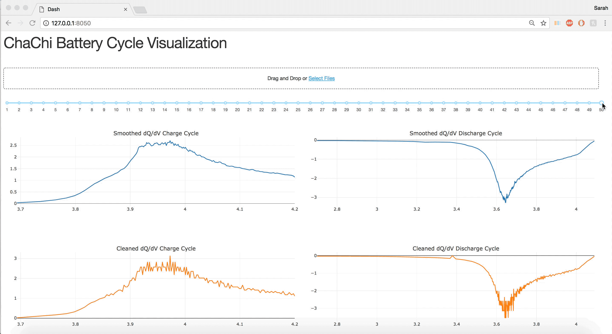

# ChaChies 
## Package for Battery Cycling Data Visualization and Interpretation
### TO-DO
- Make project pip installable 
- add photo of chinchilla 


### How to Install 
```
pip install chachies  
```
### Software Dependencies 
- Python3 
- For python packages see requirements.txt

## Organization of the project
```
app/
    data/
    README.md
    app.py 
chachies/ 
    data/
    tests/
        data/
        README.md
        __init___.py
        test_chachifuncs.py
        test_descriptors.py
    __init__.py
    chachies.py 
    chachifuncs.py
    descriptors.py 
    svc_model.sav
docs/ 
    design/
    ppt/
    README.md
examples/
    Images/ 
    README.md
LICENSE
README.md
requirements.txt
setup.py
```

## Preview of app 


For more see ```app/```

## Data Visualization 
Make sure to install the following dash libraries
```
pip install dash==0.21.0  # The core dash backend
pip install dash-renderer==0.11.3  # The dash front-end
pip install dash-html-components==0.9.0  # HTML components
pip install dash-core-components==0.18.1  # Supercharged components
pip install plotly --upgrade  # Latest Plotly graphing library
```

To run the app run the following in terminal:
```
python app.py
```
Which should return
```
 * Running on http://someurl/ (Press CTRL+C to quit)
```
Type that URL in browser to launch


