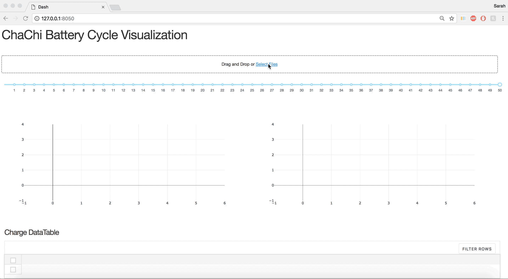

## Data Visualization using DASH by Plotly 

### Usage
- Load in cycling data from ```Clean_Whole_Sets``` that has been cleaned using chachies.clean()  




- Takes a while...


- Interact with graph to explore dQ/dV through different cycles 


- Interactive tables for data exploration 


### Requirements 
Make sure to install the following dash libraries
```
pip install dash==0.21.0  # The core dash backend
pip install dash-renderer==0.11.3  # The dash front-end
pip install dash-html-components==0.9.0  # HTML components
pip install dash-core-components==0.18.1  # Supercharged components
pip install plotly --upgrade  # Latest Plotly graphing library
```

To run the app run the following in terminal:
```
python app.py
```
Which should return
```
 * Running on http://127.0.0.1:8050/ (Press CTRL+C to quit)
```
Type that URL in browser to launch

