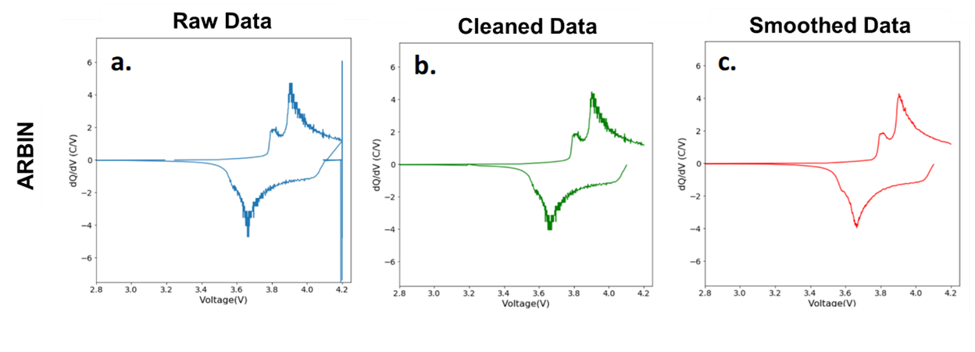

## Summary 
In order to study long-term degradation and charge storage mechanisms in batteries, researchers often cycle these electrochemical cells for hundreds or even thousands of charge and discharge cycles. The raw data produced during cycling can be interpreted via a variety of techniques that each highlight specific aspects of how the battery is functioning.  Differential capacity (dQ/dV) analysis, one such technique, results in plots of the differential capacity – the charge introduced into the battery during a small change in voltage – _vs._ the voltage. Electrochemical reactions result in significant charge introduced into the cell across a small voltage window. In the differential capacity plot, this behavior results in a peak for each electrochemical reaction. Therefore, differential capacity plots are particularly useful for highlighting the various electrochemical events occurring within the cell, specific to each cycle [@marzocca_atwater; @torai_nakagomi_yoshitake_yamaguchi_oyama_2016; @aihara_ito_omoda_yamada_fujiki_watanabe_park_doo_2016; @christophersen_shaw_2010; @christophersen_bloom_thomas_gering_henriksen_battaglia_howell_2006; @weng_cui_sun_peng_2013]. In turn, these peaks carry important characteristics of the electrochemical reaction. For example, the location of the peak indicates at what voltage the reaction occurs, and the area of the peak is linked to the amount of charge exchanged in the reaction. 

We present DiffCapAnalyzer, a Python package for extracting and tracking differential capacity curve features through multiple charge and discharge cycles. DiffCapAnalyzer provides cleaned dQ/dV curves, peak locations, peak heights, peak areas, and other characteristics specific to each cycle from raw battery cycling data. 

## Statement of Need
Traditionally, when using differential capacity plots, researchers have drawn conclusions based on an arbitrarily chosen subset of cycles and reported mainly qualitative claims on how peaks shift during cycling, due to the difficulties in analyzing the full amount of data produced in the differential capacity plots. Additionally, although it is known that peak shapes and areas correlate to important electrochemical events, only a few papers report using peak deconvolution as a method to interpret dQ/dV plots [@torai_nakagomi_yoshitake_yamaguchi_oyama_2016; @aihara_ito_omoda_yamada_fujiki_watanabe_park_doo_2016; @bian_model_2019; @huang_incremental_2019; @he_comparative_2020]. Further, there does not exist any standardized method for peak deconvolution of differential capacity plots. These issues can largely be attributed to the lack of software designed for investigating sets of dQ/dV curves. Prior to DiffCapAnalyzer, no open source software has been available to researchers for the analysis of differential capacity curves through peak deconvolution.

## Description
The software described herein, DiffCapAnalyzer, has been developed to address the drawbacks associated with differential capacity analysis by processing cycling data in a chemistry-agnostic manner. This is done by calculating differential capacity from the given raw cycling data using Equation 1, cleaning and smoothing the dQ/dV plots, and performing automatic peak locating and deconvolution for every cycle within the dataset. 

$$(dQ/dV)_i=(Q_i-Q_{(i-1)})/(V_i-V_{(i-1)})\tag*{(1)}$$

In differential capacity curves without any cleaning or smoothing, there is significant noise and large step-wise changes present. This is a common problem when the denominator of Equation 1 approaches zero [@bloom_jansen_abraham_knuth_jones_battaglia_henriksen_2005; @huang_incremental_2019]. Therefore, in order to accurately identify peaks, the data was cleaned by removing points such that the voltage difference between datapoints was at least 0.001 V. Subsequently, the curve was smoothed using a Savitzky-Golay filter, which is a moving polynomial of specified order fit over a specified number of data points. At the current state of the software, the polynomial order of the Savitzky-Golay filter is set at 3 with a window length of 9 data points, as these seemed the best parameters on the data tested to preserve important features while removing noise. This cleaning process is summarized in \autoref{Figure 1}:
 

Once the data is clean, the software automatically finds peaks in the dQ/dV curves utilizing the PeakUtils Python package [@peakutils], and returns the peak heights and the peak locations, as shown by an example cycle in \autoref{Figure 2}a.  These peak heights and locations are then used to inform the model build, which is individualized to each cycle contained in the dataset. The model consists of Pseudo-Voigt distributions positioned at the identified peak locations and a baseline Gaussian distribution that captures the area that is not part of the Psuedo-Voigt distributions. The Pseudo-Voigt distribution described by Equations 2 and 3 is simply the linear combination of a Gaussian and a Lorentzian. This distribution is often used in fitting experimental spectral data due to it being a highly generalizable function able to fit a large variety of peak shapes [@wertheim_butler_west_buchanan_1974].

$$f_v(x,A,\mu,\sigma,\alpha)=\frac{(1- \alpha)A}{\sigma_g \sqrt{2 \pi}}\exp{[-{(x- \mu)}^2/2 {\sigma_g}^2]}+\frac{\alpha A}{\pi}[\frac{\sigma}{{(x-\mu)}^2 + \sigma^2}]\tag*{(2)}$$

$$\sigma_g = \sigma/\sqrt{2 \ln{2}}\tag*{(3)}$$

Once the model is generated, an optimized fit is found by allowing all parameters to vary except the center position of the Pseudo-Voigt peaks, which are assigned via the previously identified peak locations. \autoref{Figure 2}b presents an example of an initial model fit and the model fit once optimized specifically for that charge cycle.

Further example model fits can be found on [GitHub](https://github.com/nicolet5/DiffCapAnalyzer/). From this model, peak areas, widths, and shapes can be extracted and examined to give further insight into the electrochemical processes occurring.  The software also utilizes an SQLite database backend to store raw data, cleaned data, model parameters, and peak descriptors for each cycle. In addition to the data processing abilities of the software, a Dash-based web application has been developed where users can upload their own raw data to be processed and visualize the resulting dQ/dV plots and peak descriptors. Users can also evaluate the model fit, alter the threshold for peak detection, and update the model and descriptors in the database. From this application users can also download the cycle descriptors data as a CSV file for their own uses. Further instructions and descriptions of the software functionality can be found in the [DiffCapAnalyzer Github repo](https://github.com/nicolet5/DiffCapAnalyzer/).

In summary, DiffCapAnalyzer provides the ability to quantitatively analyze battery cycling data. The peak descriptors obtained from DiffCapAnalyzer could be used to classify electrochemical events, visualize battery degradation over time, or as features in state of health analyses. This package also lays the groundwork for a standardized method for cleaning and analyzing this type of data. We hope that this Python package advances the field of electrochemistry and enables researchers to better analyze, interpret, and present their battery cycling data.

## Acknowledgments
This project was supported by: Data Intensive Research Enabling Clean Technology (DIRECT) National Science Foundation (NSF) National Research Traineeship (DGE-1633216), the State of Washington through the University of Washington (UW) Clean Energy Institute and the UW eScience Institute, in part upon the work of S.A. and G.A.W. supported by the NSF Graduate Research Fellowship under Grants No. DGE-1762114 and DGE-1256082, respectively, and via funding from the Washington Research Foundation.

## References

